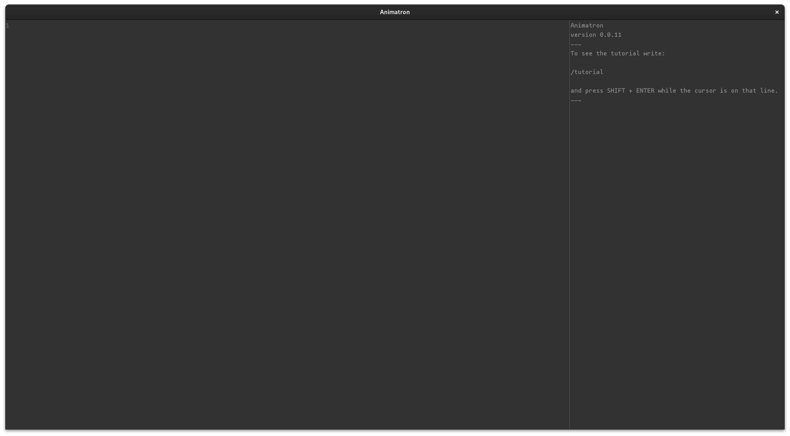

= Animatron Tutorial
:toc: left
// based on https://docs.godotengine.org/en/stable/getting_started/introduction/index.html

This series will introduce you to *Animatron* and give you an overview of its features.

In the following pages, you'll learn what you can do with Animatron. We will introduce the most essential concepts, run you through the interface, the basic keybindings (keyboard shortcuts) and give you tips to make the most of your time learning it.

== Introduction

This section will help you find out what you need to get started and introduce some broad features to give you a feel for what you can achieve with Animatron.

=== What is Animatron

Animatron is an experimental environment designed to improvise with image sequences in a live performance. You can use it to create visuals by combining animations in real time, just like a musician would combine notes with an instrument to create music.

There's plenty of full-featured software for generating visuals in a live performance. Nearly all of them, though, work at the pixel level using something called _shaders_. Animatron, on the other hand, uses the image sequence as the building block. The former are to visuals what an audio synthesizer is to music, while Animatron would be more of a sampler.

=== What can Animatron do?

If you have ever worked on animation, you know it takes a crazy amount of time and work, and it's completely unthinkable to do it as a performing art. With some preparation, Animatron allows you to do exactly that: perform as an animator.

All you need is a few image sequences and some way to control the software, which can be done in many ways, although it was initially developed with live coding in mind.

You could "play" it with a MIDI keyboard, as an image piano, so to speak.

Or with the motion sensors of your phone.

It can also be performed collaboratively, with many users controling it at the same time, or cross-controling many Animatron instances in a multi-user setup.

I use it as my go-to slideshow engine when I give workshops.

=== How does it work?

To do something with Animatron you need to send it *commands*, which is how we call https://en.wikipedia.org/wiki/Open_Sound_Control[OSC] messages in Animatron.

OSC is a protocol to send messages between systems, usually containing values. It's very common in many devices and platforms and can be used over the network.

== Overview of key concepts

=== Actors

In Animatron, everything is an *actor*. You put actors on the stage, and make them play image sequences (animations). Then you can modify their playback speed, transform them and move them around. You can group them, arrange their stacking order, and change their visibility, and many many other things.

=== Commands

As we said before, you need to send commands to Animatron with the instructions you want it to perform.

A command is an OSC message that can be sent from any software that supports the OSC protocol. It can be from the same computer where Animatron is running or from another device in the same network.

In case there's no other software to control it, you can type commands in the editor included in Animatron. We'll use it for the rest of the tutorial.

For everything that you can do with Animatron, there's a command for it. See the full <<help.adoc#,OSC reference documentaion>> for the list of available commands.

==== Custom commands

As you progress you'll want to do more complex things. It can be annoying to type all the commands for complex behaviours everytime you want need them to happen.

To simpify this, you can create your new commands to group complex command sequences. These are called *defs*, for _definition_. As you would expect, there's also a command for it.

== Animatron's Interface

In this section we give a brief overview of Animatron's interface and controls to use it.

=== The Editor

When you launch Animatron, you see an empty stage with some text on the right and a `1` on the top left corner.

The text on the right is the *post window*. Here is where you'll get feedback messages from Animatron, such as lists of items you ask for, errors when something went wrong, or hints when you ask for help.

The number on the top left corner is the number of the first line in the code editor. This is where you will be typing your commands.

=== Keybindings (controls)
